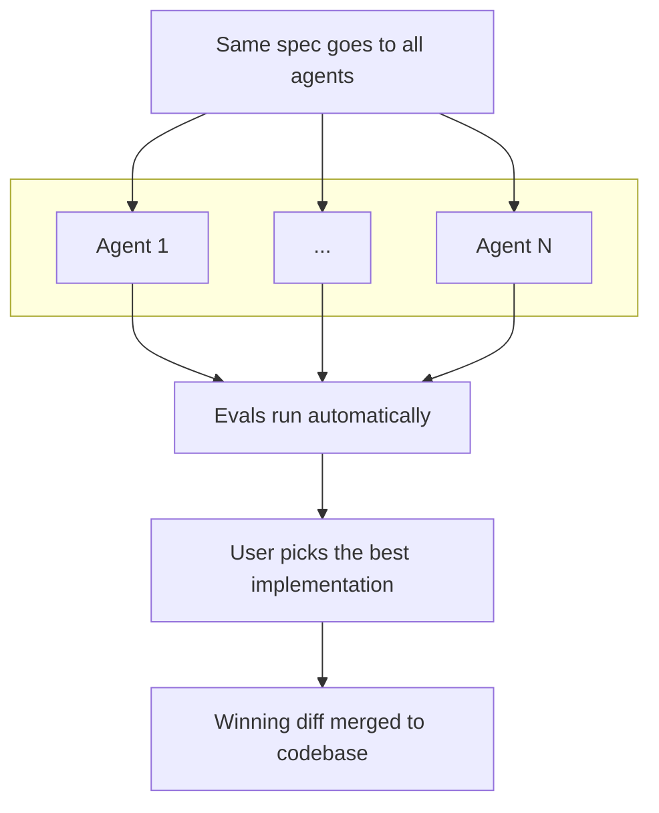

# Voratiq

Run coding agents against each other. Merge the winner.


## Installation

Voratiq is in public beta. Install via npm:

```bash
npm install -g voratiq
```

### Requirements

Core:

- Node 20+
- git
- 1+ AI coding agent (Claude [>=2.0.55](https://github.com/anthropics/claude-code?tab=readme-ov-file#get-started), Codex [>=0.66.0](https://github.com/openai/codex?tab=readme-ov-file#quickstart), or Gemini [>=0.19.4](https://github.com/google-gemini/gemini-cli?tab=readme-ov-file#quick-install))

Platform-specific:

- macOS: `ripgrep`
- Linux (Debian/Ubuntu): `bubblewrap`, `socat`, `ripgrep`

See the [sandbox runtime docs](https://github.com/anthropic-experimental/sandbox-runtime/blob/1bafa66a2c3ebc52569fc0c1a868e85e778f66a0/README.md#platform-specific-dependencies) for installation instructions.

Note: Windows is not currently supported.

## Quick Start

```bash
# Initialize workspace
voratiq init

# Generate a spec
voratiq spec \
  --description "add dark mode toggle with localStorage persistence" \
  --agent <agent-id> \
  --yes

# Run agents in parallel
voratiq run --spec .voratiq/specs/add-dark-mode-toggle.md

# Review results
voratiq review --run <run-id> --agent <agent-id>

# Apply the best solution
voratiq apply --run <run-id> --agent <agent-id>
```

For a full walkthrough, see the [CLI tutorial](https://github.com/voratiq/voratiq/blob/main/docs/tutorial.md).

See the [docs](https://github.com/voratiq/voratiq/blob/main/docs/index.md) for core concepts, CLI reference, and configuration guides.

## How It Works

The same spec goes to all agents, evals run automatically, human picks the winner.



No single model is best for every task. We use selection pressure because it leads to high quality code.

## License

Voratiq is available under the [MIT License](https://github.com/voratiq/voratiq/blob/main/LICENSE).
