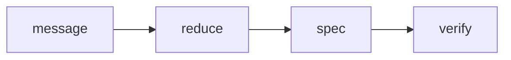
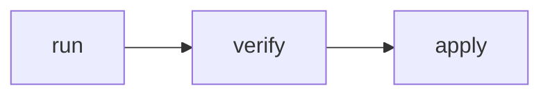

# Getting Started

Voratiq gives multi-agent workflows structure, verification, and a record of what happened.

This guide shows you when this kind of framework is useful. We'll walk through two workflows that use multi-agent behavior in different ways to produce better results.

First, in the planning workflow, a swarm widens the search space: multiple agents explore the problem from different angles, which gives us more options before we narrow them into a plan.

Second, in the execution workflow, a swarm gives us alternatives to compare: multiple agents generate concrete solutions to the same task, then we choose the best one.

Verification is what makes both workflows manageable. A swarm can produce more drafts, specs, and implementations than is practical to review manually, so verification compares the outputs and helps surface the best candidates.

To show how this works, we'll build a small image generation CLI from scratch.

To get started, install Voratiq:

```bash
npm install -g voratiq
```

For this example, start inside a fresh git repo named `image-cli`.

<details>
<summary>Repo setup</summary>

```bash
mkdir image-cli
cd image-cli
git init
git commit --allow-empty -m "Start image CLI project"
```

</details>

Then, launch Voratiq:

```bash
voratiq
```

`voratiq` initializes `.voratiq/` and then launches your native coding harness from the current repository. It also:

- boots the bundled Voratiq MCP server so operators are available inside the agent
- seeds the agent with repo-aware context
- records the interactive session itself under `.voratiq/interactive/`
- makes workflow artifacts first-class state alongside your normal native-agent session

Once `voratiq` started, the agent got this prompt describing what we'd like to build:

```text
I want to build a tiny image generation CLI in this fresh repo.

The UX should be really simple, e.g.: `image-cli "a tiny robot watering plants" --out robot.png`

The goal is to keep the project very small, ideally a single file under 200 lines plus a few tests.

Let's use Voratiq's message operator to explore the best 3-4 ways to structure a minimal v1.
```

## Exploration and Design Workflow

When the task is still fuzzy, start by generating options and turning them into a plan:



In this walkthrough, the flow was `message -> reduce -> spec -> verify`: widen the search space, compress it, turn it into draft plans, then rank those drafts before any implementation work started.

### Explore with `message`

From inside the native agent session, the agent called the Voratiq `message` operator directly:

```text
voratiq.voratiq_message({
  "prompt":"You are helping design a tiny image generation CLI in a fresh repo. Constraints:
- UX target: `image-cli \"a tiny robot watering plants\" --out robot.png`
- Keep project extremely small: ideally one source file under ~200 lines plus a few tests
- Minimal v1 only; avoid premature abstraction
- Focus on local repo structure and implementation shape, not marketing or roadmap

Produce 4 distinct ways to structure v1. For each option, include:
1. Short name
2. Tiny file layout
3. Core control flow from CLI parse to image write
4. Pros
5. Cons
6. Whether you'd recommend it for this constraint set

Bias toward pragmatic options that a solo developer can build quickly. Keep each option concise and concrete."
})
```

<details>
<summary>Output</summary>

```json
{
  "version": 1,
  "operator": "message",
  "status": "succeeded",
  "timestamp": "2026-04-14T16:35:21.693Z",
  "ids": {
    "sessionId": "20260414-163422-lbjet"
  },
  "artifacts": [
    {
      "kind": "session",
      "path": ".voratiq/message/sessions/20260414-163422-lbjet",
      "role": "session"
    },
    {
      "kind": "output",
      "path": ".voratiq/message/sessions/20260414-163422-lbjet/claude-opus-4-6/artifacts/response.md",
      "role": "output",
      "agentId": "claude-opus-4-6"
    },
    {
      "kind": "output",
      "path": ".voratiq/message/sessions/20260414-163422-lbjet/gpt-5-4-high/artifacts/response.md",
      "role": "output",
      "agentId": "gpt-5-4-high"
    }
  ]
}
```

</details>

The operator returned a recorded session you can reopen later, plus one artifact per agent under `.voratiq/message/sessions/...`. The replies narrowed quickly toward a single-file Python CLI with `argparse`, one small helper seam, and minimal abstraction. The main open question was transport: raw `httpx` or the OpenAI Python SDK.

### Synthesize with `reduce`

After that exploration, the agent used `reduce` to collapse the options into one working direction:

```text
voratiq.voratiq_reduce({"target":{"id":"20260414-163422-lbjet","type":"message"}})
```

<details>
<summary>Output</summary>

```json
{
  "version": 1,
  "operator": "reduce",
  "status": "succeeded",
  "timestamp": "2026-04-14T16:43:14.519Z",
  "ids": {
    "sessionId": "20260414-164208-kyxju",
    "messageId": "20260414-163422-lbjet"
  },
  "artifacts": [
    {
      "kind": "session",
      "path": ".voratiq/reduce/sessions/20260414-164208-kyxju",
      "role": "session"
    },
    {
      "kind": "message",
      "path": ".voratiq/message/sessions/20260414-163422-lbjet",
      "role": "input"
    }
  ]
}
```

</details>

After `reduce`, the agent used `list` to inspect the recorded session without rerunning anything:

```text
voratiq.voratiq_list({"operator":"reduce","mode":"detail","sessionId":"20260414-164208-kyxju","verbose":true})
```

<details>
<summary>Output</summary>

```json
{
  "operator": "reduce",
  "mode": "detail",
  "session": {
    "operator": "reduce",
    "sessionId": "20260414-164208-kyxju",
    "status": "succeeded",
    "target": {
      "kind": "message",
      "sessionId": "20260414-163422-lbjet"
    },
    "workspacePath": ".voratiq/reduce/sessions/20260414-164208-kyxju"
  }
}
```

</details>

By then the shape was clear: a single `image_cli.py`, one `tests/test_cli.py`, minimal packaging, a small `generate_image(prompt) -> bytes` seam, and `httpx` as the lighter transport choice. That reduced result became the input to `spec`.

The agent summarized it this way:

> My recommendation is:
>
> - Start with `image_cli.py` as the only source file.
> - Use `argparse`.
> - Keep one helper like `generate_image(prompt) -> bytes` inside that same file.
> - Add a few tests for arg parsing, backend mocking, and file writing.

### Turn the direction into a spec

With that direction set, the agent used `spec` to draft the implementation contract:

```text
voratiq.voratiq_spec({
  "title":"Minimal image-cli v1",
  "description":"Draft a concrete implementation spec for a tiny image generation CLI in a fresh repo.

Context and decisions already made:
- Target UX: `image-cli \"a tiny robot watering plants\" --out robot.png`
- Repo is basically blank (`README.md` only)
- Keep the project extremely small: ideally one source file under ~200 lines plus a few tests
- Minimal v1 only; avoid premature abstraction
- Prior exploration converged on a Python-first design

Recommended shape to spec:
- One top-level Python source file, e.g. `image_cli.py`
- A few focused tests, e.g. `tests/test_cli.py`
- Minimal packaging metadata in `pyproject.toml` so the CLI can be installed/executed as `image-cli`
- Use `argparse` for CLI parsing
- Keep one small internal helper seam such as `generate_image(prompt) -> bytes` inside the same source file for testability
- Parse prompt and `--out`, call the image backend, decode returned image bytes/base64, and write the output file
- Read API key from environment

Open implementation choice the spec should address explicitly:
- Backend transport choice between raw HTTP (`httpx`) and the OpenAI Python SDK
- The spec should recommend one for v1 and justify it in terms of minimalism, dependency weight, and testability"
})
```

<details>
<summary>Output</summary>

```json
{
  "version": 1,
  "operator": "spec",
  "status": "succeeded",
  "timestamp": "2026-04-14T16:47:09.837Z",
  "ids": {
    "sessionId": "20260414-164551-utbtk"
  },
  "artifacts": [
    {
      "kind": "session",
      "path": ".voratiq/spec/sessions/20260414-164551-utbtk",
      "role": "session"
    },
    {
      "kind": "spec",
      "path": ".voratiq/spec/sessions/20260414-164551-utbtk/claude-opus-4-6/artifacts/spec.md",
      "role": "candidate",
      "agentId": "claude-opus-4-6"
    },
    {
      "kind": "spec",
      "path": ".voratiq/spec/sessions/20260414-164551-utbtk/gpt-5-4-high/artifacts/spec.md",
      "role": "candidate",
      "agentId": "gpt-5-4-high"
    }
  ]
}
```

</details>

Compared with the earlier `message` prompt, this pinned down the file layout, success criteria, non-goals, and the transport decision.
Each recorded candidate keeps the canonical filename `artifacts/spec.md`; the in-file title plus the session and agent ids identify the draft.

### Verify the spec before implementation

Before generating code, the agent ran `verify` to compare the spec drafts, rank them, and decide whether the best one was ready to execute:

```text
voratiq verify --spec 20260414-164551-utbtk
```

That produced verify session `20260414-164824-bbxsy`, which ran multiple independent rubric verifiers against blinded spec artifacts:

<details>
<summary>Output</summary>

```json
{
  "sessionId": "20260414-164824-bbxsy",
  "target": {
    "kind": "spec",
    "sessionId": "20260414-164551-utbtk"
  },
  "blinded": {
    "enabled": true,
    "aliasMap": {
      "v_hys9tn7qsedh": "claude-opus-4-6",
      "v_autl2x5aaeub": "gpt-5-4-high"
    }
  },
  "methods": [
    {
      "method": "rubric",
      "verifierId": "claude-opus-4-6",
      "template": "spec-verification",
      "status": "succeeded"
    },
    {
      "method": "rubric",
      "verifierId": "gpt-5-4-high",
      "template": "spec-verification",
      "status": "succeeded"
    }
  ]
}
```

</details>

Both verifiers saw blinded aliases rather than source agent names, then reviewed the candidate specs independently. They both ranked the same draft first and marked it ready to execute:

```text
{
  "draft": "v_hys9tn7qsedh",
  "completion_status": "ready",
  "recommendation_level": "execute_now",
  "quality": "high"
}
```

This is the double-blind part of the workflow: verification compares the work, not the source agent's name. In this case, both verifiers landed on the same draft because it had a tighter acceptance contract, a clearer `httpx` rationale, and less implementation guesswork.

The agent then summarized the result for the user:

> Verification ranked the `claude-opus-4-6` draft first and marked it `execute_now` with `high` quality. Its strength is that it makes the transport decision explicitly in the frame you asked for: `httpx` over the OpenAI SDK, justified on minimalism, dependency weight, and testability, with a tighter acceptance contract and exact file layout.
>
> The `gpt-5-4-high` draft was also viable, but verify rated it lower because it leaves more implementation guesswork, keeps the file layout partly illustrative, and recommends the OpenAI SDK without engaging the dependency-weight tradeoff strongly enough.

That is what `verify` is doing here: ranking competing plans before code starts. The winning draft is what moved forward into `run`.

## Implementation Workflow

With a verified spec in hand, the question shifted from what to build to which implementation should land.

Use this workflow:



### Run the verified spec

Verification preferred the draft behind alias `v_hys9tn7qsedh`, which mapped back to the `claude-opus-4-6` spec artifact. The agent then ran that artifact directly:

```text
voratiq.voratiq_run({"specPath":".voratiq/spec/sessions/20260414-164551-utbtk/claude-opus-4-6/artifacts/spec.md"})
```

The successful run session was:

```text
20260414-172425-xgbhn
```

To inspect the run, the agent used `list` again:

```text
voratiq.voratiq_list({"operator":"run","mode":"detail","sessionId":"20260414-172425-xgbhn","verbose":true})
```

<details>
<summary>Output</summary>

```json
{
  "operator": "run",
  "mode": "detail",
  "session": {
    "operator": "run",
    "sessionId": "20260414-172425-xgbhn",
    "status": "succeeded",
    "target": {
      "kind": "spec",
      "sessionId": "20260414-164551-utbtk"
    },
    "workspacePath": ".voratiq/run/sessions/20260414-172425-xgbhn",
    "agents": [
      {
        "agentId": "claude-opus-4-6",
        "status": "succeeded",
        "changes": {
          "filesChanged": 3,
          "insertions": 250
        }
      },
      {
        "agentId": "gpt-5-4-high",
        "status": "succeeded",
        "changes": {
          "filesChanged": 3,
          "insertions": 200
        }
      }
    ]
  }
}
```

</details>

The run produced two successful implementation candidates, both preserved in the run record for later comparison.

### Verify the candidate implementations

Then the agent ran `verify` over the implementation candidates:

```text
voratiq verify --run 20260414-172425-xgbhn
```

The resulting verification session was:

```text
20260414-172953-spury
```

Again, verification compared randomized aliases rather than original agent names. In this session, the two candidates were presented as:

- `v_s0nubdx6r40k`
- `v_ocv43h93xt0o`

Both verifiers independently ranked the same candidate first:

```text
{
  "preferred": "v_s0nubdx6r40k",
  "ranking": [
    "v_s0nubdx6r40k",
    "v_ocv43h93xt0o"
  ]
}
```

This repeated the same pattern from spec verification: compare blinded candidates, converge on one, then move forward. Both candidates worked, but the preferred one kept a better seam between transport and CLI behavior:

```text
The critical differentiator is the generate_image() design:
v_s0nubdx6r40k raises RuntimeError on errors while v_ocv43h93xt0o calls sys.exit(1).
```

When the user asked whether the verifiers agreed, the interactive agent answered directly:

> Yes.
>
> Both verifiers independently ranked them the same way:
>
> 1. `v_s0nubdx6r40k`
> 2. `v_ocv43h93xt0o`
>
> They also agreed on the main reason: `v_s0nubdx6r40k` keeps `generate_image()` as a proper transport seam by raising exceptions, while `v_ocv43h93xt0o` couples that helper to CLI process-exit behavior with `sys.exit()`.

### Apply the selected result

Only after verification produced a clear recommendation did the agent resolve the winning alias back to its underlying run candidate and apply that patch:

```text
voratiq.voratiq_apply({"agentId":"gpt-5-4-high","runId":"20260414-172425-xgbhn"})
```

<details>
<summary>Output</summary>

```json
{
  "version": 1,
  "operator": "apply",
  "status": "succeeded",
  "timestamp": "2026-04-14T17:38:15.216Z",
  "ids": {
    "runId": "20260414-172425-xgbhn",
    "agentId": "gpt-5-4-high"
  },
  "artifacts": [
    {
      "kind": "run",
      "path": ".voratiq/run/sessions/20260414-172425-xgbhn",
      "role": "target"
    },
    {
      "kind": "diff",
      "path": ".voratiq/run/sessions/20260414-172425-xgbhn/gpt-5-4-high/artifacts/diff.patch",
      "role": "output",
      "agentId": "gpt-5-4-high"
    }
  ]
}
```

</details>

After apply, the fresh repo contained `image_cli.py`, `pyproject.toml`, and `tests/test_cli.py`.

The agent left one clear note after `apply`:

> The implementation matches the verified shape: single-file CLI, `argparse`, `httpx`, `generate_image()` as a clean seam, and mocked tests.
>
> I only applied and inspected the patch in this turn; I did not rerun `pytest` locally after applying it. The remaining known gap from Voratiq verify is the live API smoke test with a real `OPENAI_API_KEY`.

At that point, the repo was ready for normal follow-through: inspect the files, run the tests locally, and smoke-test with a real `OPENAI_API_KEY`.

## Questions or Feedback

Questions or feedback? Please reach out to: [support@voratiq.com](mailto:support@voratiq.com).
