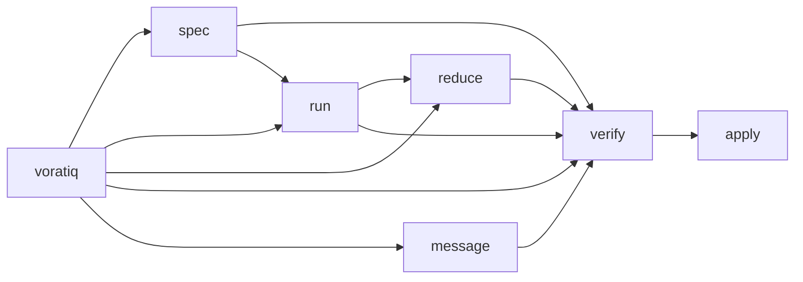

# How It Works

Voratiq is organized around composable operators, workflow shapes, verification, and the recorded artifacts and session history under `.voratiq/`.

## Product Model

Voratiq is built from modular operators that support several workflow architectures.

The three core ideas are:

- **Compose** - build workflows from operators instead of locking into one path
- **Verify** - check results before they move forward
- **Improve** - use verification outcomes to refine steps, agents, rubrics, and policies over time

## Operators

Voratiq's operators fall into four classes:

### Swarm

Swarm operators dispatch agents to produce, synthesize, or evaluate work.

| Operator  | Role                                      | Example                                                           |
| --------- | ----------------------------------------- | ----------------------------------------------------------------- |
| `spec`    | Dispatch agents to define the task        | Turn a loose task description into a structured spec              |
| `run`     | Dispatch agents to execute against a spec | Generate multiple implementations for the same task               |
| `reduce`  | Dispatch agents to synthesize artifacts   | Synthesize several artifacts into one summary                     |
| `verify`  | Dispatch agents to judge outputs          | Recommend whether a result should be applied, inspected, or rerun |
| `message` | Dispatch agents to respond to a prompt    | Collect independent responses to the same prompt                  |

### Control

Control operators manage state, inspect results, or apply selected outcomes.

| Operator | Role                                      | Example                                                  |
| -------- | ----------------------------------------- | -------------------------------------------------------- |
| `apply`  | Apply a selected result into the worktree | Apply the chosen run candidate diff                      |
| `list`   | Inspect recorded sessions and artifacts   | Reopen the final frame for a message or verify session   |
| `doctor` | Diagnose or repair workspace state        | Bootstrap `.voratiq/` or reconcile managed config safely |

### Entry

Entry commands launch or wrap larger workflows.

| Operator  | Role                         | Example                                                        |
| --------- | ---------------------------- | -------------------------------------------------------------- |
| `voratiq` | Start interactive mode       | Launch a native agent session with access to Voratiq workflows |
| `auto`    | Wrap a higher-level workflow | Run the common coding path end to end                          |

### Integration

Integration commands expose Voratiq to other tooling.

| Operator | Role                       | Example                                         |
| -------- | -------------------------- | ----------------------------------------------- |
| `mcp`    | Run the Voratiq MCP server | Expose Voratiq operators to MCP-capable clients |

Operators can be used on their own or composed into longer workflows.

## How Operators Compose



The diagram shows common connections, not one required pipeline.

## Verification

Verification answers three questions:

- whether a result should be trusted
- whether one result is stronger than another
- whether work should continue, change direction, or stop

Voratiq supports two kinds of verification:

- **Programmatic checks** — tests, type checks, lint, build commands
- **Rubric verifiers** — agents that evaluate outputs against structured instructions

Rubric verification is blinded when comparing multiple outputs: verifiers see randomized aliases, not agent names. The final result maps any recommendation back to the original output.

Verification produces a recommendation. When applicable, the recommendation includes an explicit next command:

```text
Recommendation
  Preferred Candidate: <candidate-id>
  Next Action:
    voratiq apply --run <run-id> --agent <agent-id>
```

## Sessions and Artifacts

Voratiq preserves session history under `.voratiq/`.

That workspace is usually bootstrapped automatically on first use. `voratiq doctor --fix` is the explicit setup and repair path when you want to reconcile it manually.

Voratiq keeps:

- session metadata
- artifacts (diffs, reductions, responses, summaries, logs)
- runtime configuration
- verification outputs

You can inspect what happened, compare alternatives when needed, understand why one result was recommended, and debug sessions that went wrong.

Example run session:

```text
.voratiq/run/sessions/20260113-235501-hhkox/
├── record.json
├── claude-opus-4-6/
│   ├── artifacts/
│   │   ├── diff.patch
│   │   ├── summary.txt
│   │   ├── stdout.log
│   │   ├── stderr.log
│   │   └── chat.jsonl
│   ├── runtime/
│   │   ├── manifest.json
│   │   └── sandbox.json
│   └── workspace/
└── ...
```

Durable run artifacts remain the post-run contract even after workspace scratch state is cleaned up, so recorded history stays usable as an audit trail and as input to follow-on operations like `apply`, `reduce`, and `verify`.
